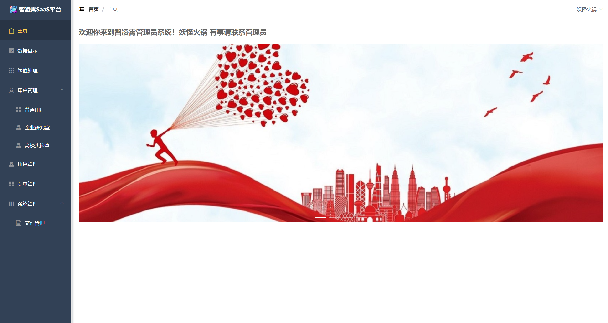
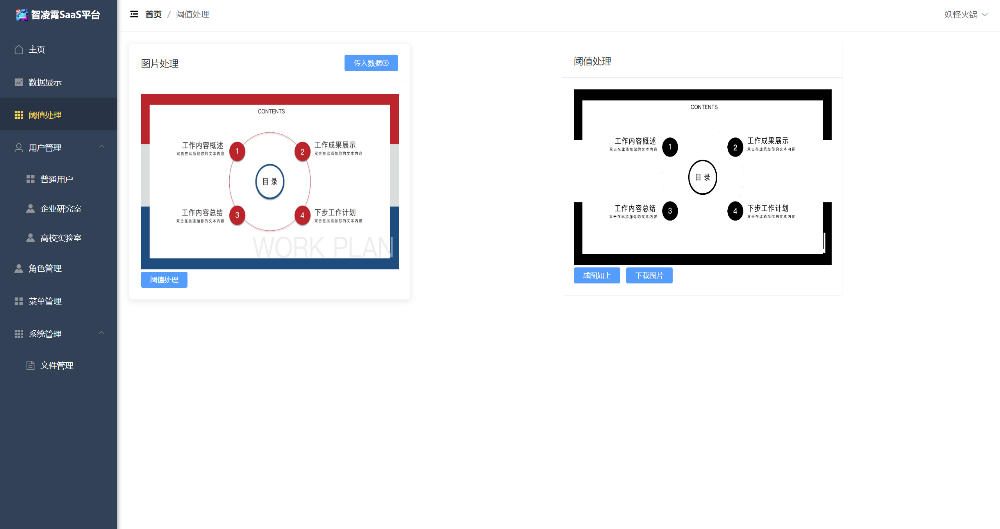

# SaaS
We are best Iter！！！

技术栈：

    1. 后端框架：SpringBoot2
    2. 前端框架：Vue2
    3. 前端组件库：ElementUI
    4. 持久层框架：MybatisPlus
    5. 数据库：MySQL
    6. ajax框架：axios
    7. 项目构建：Maven
    8. 项目管理：Git
    9. 授权认证：JWT

项目结构：
    
        spring boot
        ├── common -- 公共模块
        ├── config -- 配置模块
        ├── controller -- 控制器
        ├── entity -- 实体类
        ├── exception -- 异常处理
        ├── mapper -- 数据库操作
        ├── service -- 业务逻辑
        ├── utils -- 工具类
        ├── test -- 测试模块
        └── resource -- 资源文件
            ├── mapper -- mybatis映射文件
            ├── files -- 静态资源
            ├── templates -- 模板文件
            └── application.yml -- 配置文件

前端Vue结构:

            vue
            ├── build -- webpack配置文件
            ├── config -- 项目打包路径
            ├── src -- 源码目录
            │   ├── assets -- 静态资源
            │   ├── components -- 组件
            │   ├── router -- 路由
            │   ├── store -- vuex状态管理
            │   ├── utils -- 工具类
            │   ├── views -- 页面
            │   ├── App.vue -- 页面入口文件
            │   └── main.js -- 程序入口文件，加载各种公共组件
            ├── static -- 静态资源
            ├── test -- 测试文件
            ├── .babelrc -- ES6语法编译配置
            ├── .editorconfig -- 定义代码格式
            ├── .gitignore -- git上传需要忽略的文件格式
            └── package.json -- 项目基本信息

前端启动:
    
        1. 安装node.js
        2. 安装vue-cli
        3. 进入vue目录
        4. npm install
        5. npm run dev

后端启动:
    
            1. 安装jdk1.8
            2. 安装maven
            3. 安装mysql
            4. 运行sql文件
            5. 修改application.yml中的数据库配置
            6. 运行SpringApplication.java

项目运行截图：
Version1.0：

    
